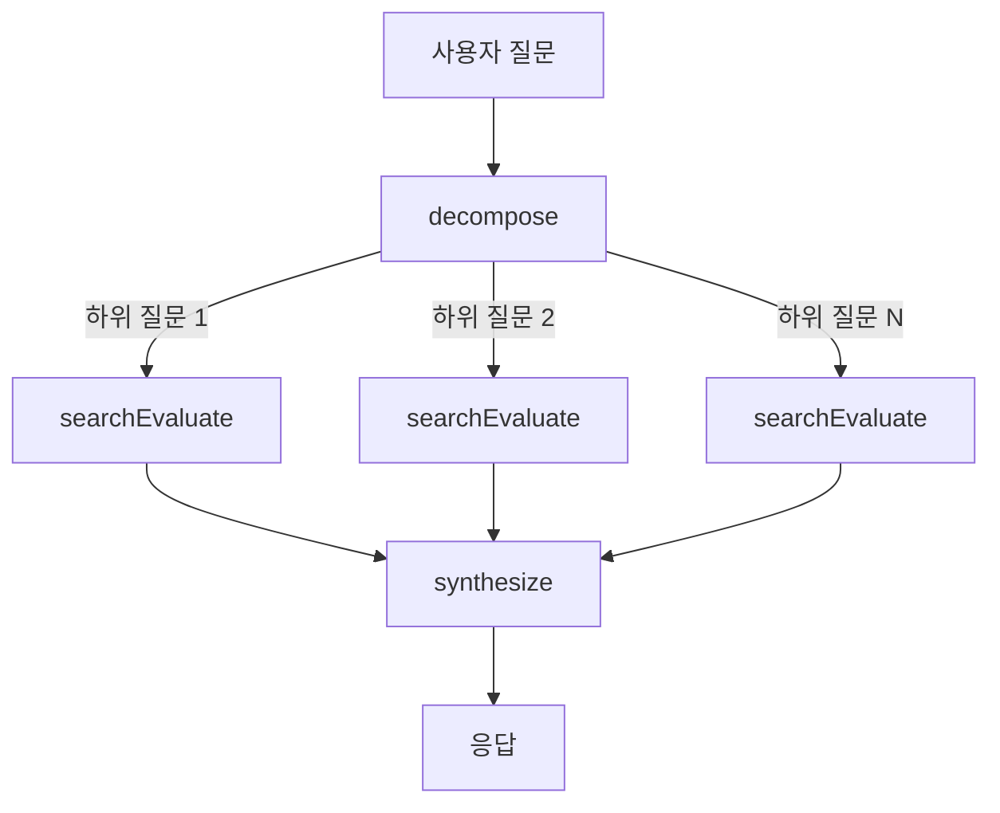

# RAG Chatbot

과제로 전달받은 파일이 미리 임베딩되어 있습니다.

라이브 데모: [https://rag-chatbot.xiyo.dev](https://rag-chatbot.xiyo.dev)

LangChain/LangGraph 기반 문서 Q&A 에이전트

---

## 구조

| 기능 | 엔트리 파일 | 흐름 |
|------|-------------|------|
| PDF 임베딩 | `src/lib/server/embedding.service.ts` | PDF 업로드 → 청킹 → 임베딩 → DB 저장 |
| RAG 검색 | `src/lib/server/chat/graph.ts` | 질문 분해 → 벡터 검색 → 결과 평가 → 응답 합성 |

---

## 핵심 파일

LangChain/LangGraph 관련 코드는 모두 `src/lib/server/` 경로에 모여 있습니다.
나머지 부분은 프론트엔드 기능이며, 최대한 코드를 격리하여 개발했습니다.

| 파일 | 역할 |
|------|------|
| [embedding.service.ts](https://github.com/XIYO/rag-chatbot/tree/main/src/lib/server/embedding.service.ts) | PDF 로드, 청킹, 임베딩 생성 |
| [chat/graph.ts](https://github.com/XIYO/rag-chatbot/tree/main/src/lib/server/chat/graph.ts) | LangGraph 상태 머신 정의 |
| [chat/state.ts](https://github.com/XIYO/rag-chatbot/tree/main/src/lib/server/chat/state.ts) | 상태 스키마 Annotation API |
| [chat/retriever.ts](https://github.com/XIYO/rag-chatbot/tree/main/src/lib/server/chat/retriever.ts) | SupabaseVectorStore 벡터 검색 |
| [agents/decompose.agent.ts](https://github.com/XIYO/rag-chatbot/tree/main/src/lib/server/chat/agents/decompose.agent.ts) | 질문 분해, Send로 병렬 처리 |
| [agents/searchEvaluate.agent.ts](https://github.com/XIYO/rag-chatbot/tree/main/src/lib/server/chat/agents/searchEvaluate.agent.ts) | 검색 + 평가 루프 Corrective RAG |
| [agents/synthesize.agent.ts](https://github.com/XIYO/rag-chatbot/tree/main/src/lib/server/chat/agents/synthesize.agent.ts) | 인용 포함 응답 합성 |

---

## Prompt Engineering

모델을 수정하지 않고 프롬프트 설계만으로 출력을 제어했습니다.

### 적용 기법

**Structured Output**: JSON 스키마로 출력 형식을 강제합니다. `isRelevant`, `isComplex`, `subQueries` 같은 필드를 정의하면 LLM이 반드시 해당 구조로 응답합니다.

**조건부 규칙**: `when`/`only when` 패턴으로 판단 기준을 명시합니다. "의심스러우면 관련 있다고 판단"처럼 경계 케이스 처리를 지시합니다.

**부정 지시**: `Do NOT add context or infer additional information`처럼 하지 말아야 할 행동을 명시하여 과잉 해석을 방지합니다.

**역할 부여**: `You are a document-based Q&A assistant`로 응답 톤과 범위를 제한합니다.

**온도 제어**: 분석/평가 작업은 `temperature: 0`으로 일관된 결과를 보장하고, 응답 생성은 `temperature: 0.7`로 자연스러운 문장을 유도합니다.

### 에이전트별 적용

| 에이전트 | 목적 | 핵심 지시 |
|----------|------|-----------|
| decompose | 질문 분해 | 관련성 판단 기준, 복합 질문 분리 조건 |
| searchEvaluate | 쿼리 변환 | 영어 변환, 키워드만 추출, 추론 금지 |
| searchEvaluate | 결과 평가 | 충분성 판단 기준, 재검색 조건 |
| synthesize | 응답 생성 | 마크다운 포맷, 인용 형식, 스타일 가이드 |

---

## 기술 선택

### 언어: TypeScript

LangChain이 공식 지원하는 언어는 Python과 TypeScript 두 가지입니다.
Python + Streamlit 조합으로 빠르게 프로토타입을 만들 수 있다는 장점이 있지만,
Streamlit은 한 번 써본 정도라 이번 과제에서는 실험적인 도전보다
가장 익숙한 스택으로 안정적인 프로토타입을 만드는 것이 더 중요하다고 판단했습니다.

TypeScript 중에서도 프론트엔드 프레임워크인 SvelteKit을 사용하면
백엔드와 프론트엔드를 하나의 코드베이스 안에서 관리할 수 있어 최종 선택하게 되었습니다.

### LLM / 임베딩: OpenAI

Structured Output을 지원하는 모델 중에서 선택했습니다.
Gemini, Claude, GPT를 모두 사용해봤는데, 저렴한 모델 기준으로 GPT가 가장 안정적이었습니다.
Gemini는 환각이 잦았고, Claude는 응답 속도가 느렸습니다.

작업 복잡도에 따라 모델을 분리했습니다.
분석/평가 같은 단순 작업은 gpt-4o-mini, 응답 생성은 gpt-4o를 사용합니다.

### VectorDB: PostgreSQL + pgvector (Supabase)

벡터 DB는 단순성 때문에 PostgreSQL + pgvector 조합을 선택했습니다.(RDB에 벡터 DB 기능을 추가했습니다.)
전용 벡터 DB에는 아직 익숙하지 않아서, 가장 익숙한 PostgreSQL에 pgvector 확장을 붙이는 방식으로 연결했습니다.

라이브 데모를 제공하려면 인프라를 직접 구축해야 하는데, 이번 과제에서는 시간적으로 부담이 컸습니다.
그래서 Supabase를 사용해 별도 인프라 없이 빠르게 서비스를 구축했습니다.

---

## RAG Search Pipeline

사용자 질문이 들어오면 먼저 `decompose` 단계에서 복합 질문인지 판단합니다.
여러 주제를 다루는 질문이라면 하위 질문으로 분해하여 각각 병렬로 처리합니다.

각 하위 질문은 `searchEvaluate` 단계를 거칩니다.
벡터 검색으로 관련 문서를 찾고, LLM이 검색 결과가 질문에 답하기에 충분한지 평가합니다.
결과가 부족하면 쿼리를 개선하여 재검색합니다.

모든 하위 질문의 검색이 완료되면 `synthesize` 단계에서 결과를 종합하여
인용(`[ref:N]`)이 포함된 최종 응답을 생성합니다.

