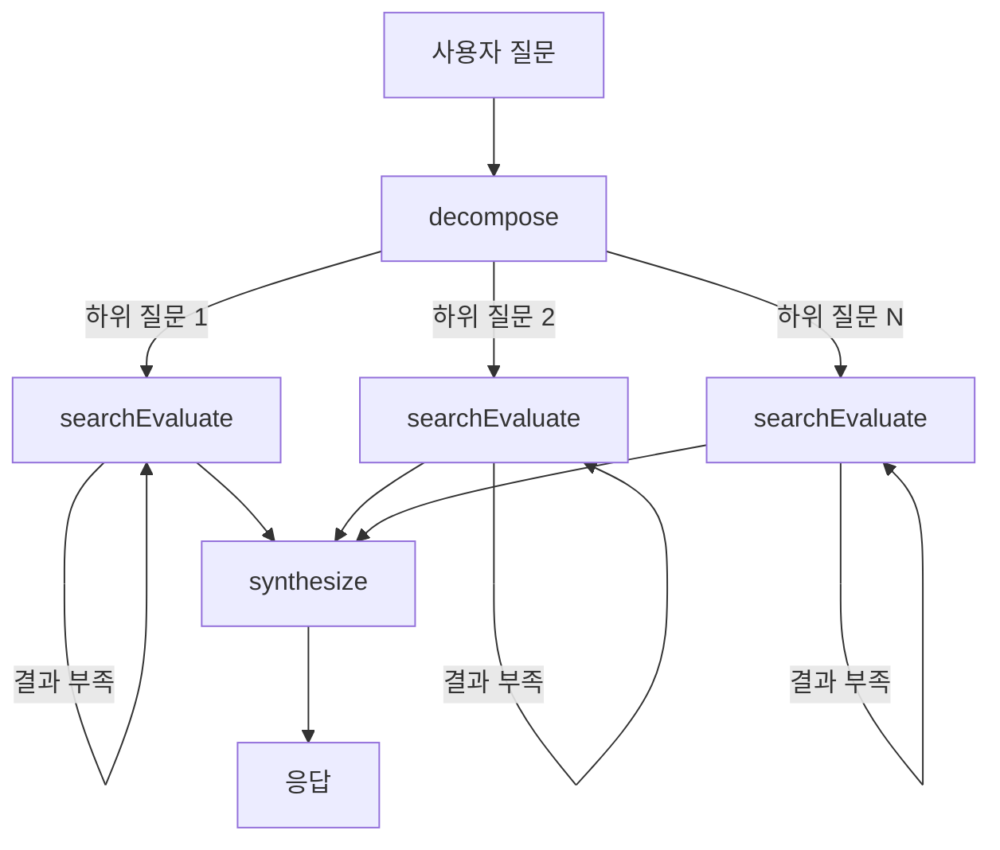

# RAG Chatbot

라이브 데모: [https://rag-chatbot.xiyo.dev](https://rag-chatbot.xiyo.dev)

LangChain/LangGraph 기반 문서 Q&A 에이전트

---

## 기술 선택

### 언어: TypeScript

LangChain이 공식 지원하는 언어는 Python과 TypeScript 두 가지입니다.
Python + Streamlit 조합으로 빠르게 프로토타입을 만들 수 있다는 장점이 있지만,
Streamlit은 한 번 써본 정도라 이번 과제에서는 실험적인 도전보다
가장 익숙한 스택으로 안정적인 프로토타입을 만드는 것이 더 중요하다고 판단했습니다.

TypeScript 중에서도 프론트엔드 프레임워크인 SvelteKit을 사용하면
백엔드와 프론트엔드를 하나의 코드베이스 안에서 관리할 수 있어 최종 선택하게 되었습니다.

### LLM / 임베딩: OpenAI (GPT-4o-mini, text-embedding-3-small)

로컬 임베딩 모델도 존재하지만, 설치와 실험에 시간이 필요해 이번 과제에서는 불리했습니다.
Gemini의 임베딩 모델도 고려했으나, 최종적으로는 API 설계가 가장 제품화된 OpenAI를 선택했습니다.

특히 이 프로젝트에서는 LLM이 구조화된 출력(Structured Output)을 안정적으로 생성하는 것이 중요했습니다.
Gemini는 필드 구조만 지킬 뿐 값의 형식까지 강제할 수 없었는데,
GPT는 JSON 스키마 기반으로 값까지 강제할 수 있어서
질문 분해, 검색 결과 평가 같은 단계에서 더 신뢰할 수 있었습니다.

임베딩 모델인 text-embedding-3-small은 멀티링구얼을 지원하여
한국어와 영어가 혼용된 문서도 안정적으로 처리할 수 있었습니다.(다만 정확도가 그렇게 좋은건 아닌것 같아, 질의를 영어로 변환 후 질의를 합니다)

### VectorDB: PostgreSQL + pgvector (Supabase)

벡터 DB는 단순성 때문에 PostgreSQL + pgvector 조합을 선택했습니다.
전용 벡터 DB에는 아직 익숙하지 않아서, 가장 익숙한 PostgreSQL에 pgvector 확장을 붙이는 방식으로 연결했습니다.

라이브 데모를 제공하려면 인프라를 직접 구축해야 하는데, 이번 과제에서는 시간적으로 부담이 컸습니다.
그래서 Supabase를 사용해 별도 인프라 없이 빠르게 서비스를 구축했습니다.

---

## 구조

| 기능 | 엔트리 파일 | 흐름 |
|------|-------------|------|
| PDF 임베딩 | `src/lib/server/embedding.service.ts` | PDF 업로드 → 청킹 → 임베딩 → DB 저장 |
| RAG 검색 | `src/lib/server/chat/graph.ts` | 질문 분해 → 벡터 검색 → 결과 평가 → 응답 합성 |

---

## RAG Search Pipeline

사용자 질문이 들어오면 먼저 `decompose` 단계에서 복합 질문인지 판단합니다.
여러 주제를 다루는 질문이라면 하위 질문으로 분해하여 각각 병렬로 처리합니다.

각 하위 질문은 `searchEvaluate` 단계를 거칩니다.
벡터 검색으로 관련 문서를 찾고, LLM이 검색 결과가 질문에 답하기에 충분한지 평가합니다.
결과가 부족하면 쿼리를 개선하여 재검색합니다 (최대 2회).
이 패턴을 Corrective RAG라고 합니다.

모든 하위 질문의 검색이 완료되면 `synthesize` 단계에서 결과를 종합하여
인용(`[ref:N]`)이 포함된 최종 응답을 생성합니다.

---

## 핵심 파일

LangChain/LangGraph 관련 코드는 모두 `src/lib/server/` 경로에 모여 있습니다.
나머지 부분은 프론트엔드 기능이며, 최대한 코드를 격리하여 개발했습니다.

| 파일 | 역할 |
|------|------|
| `src/lib/server/embedding.service.ts` | PDF 로드, 청킹, 임베딩 생성 |
| `src/lib/server/chat/graph.ts` | LangGraph 상태 머신 정의 |
| `src/lib/server/chat/state.ts` | 상태 스키마 (Annotation API) |
| `src/lib/server/chat/retriever.ts` | SupabaseVectorStore 벡터 검색 |
| `src/lib/server/chat/agents/decompose.agent.ts` | 질문 분해, Send로 병렬 처리 |
| `src/lib/server/chat/agents/searchEvaluate.agent.ts` | 검색 + 평가 루프 (Corrective RAG) |
| `src/lib/server/chat/agents/synthesize.agent.ts` | 인용 포함 응답 합성 |
