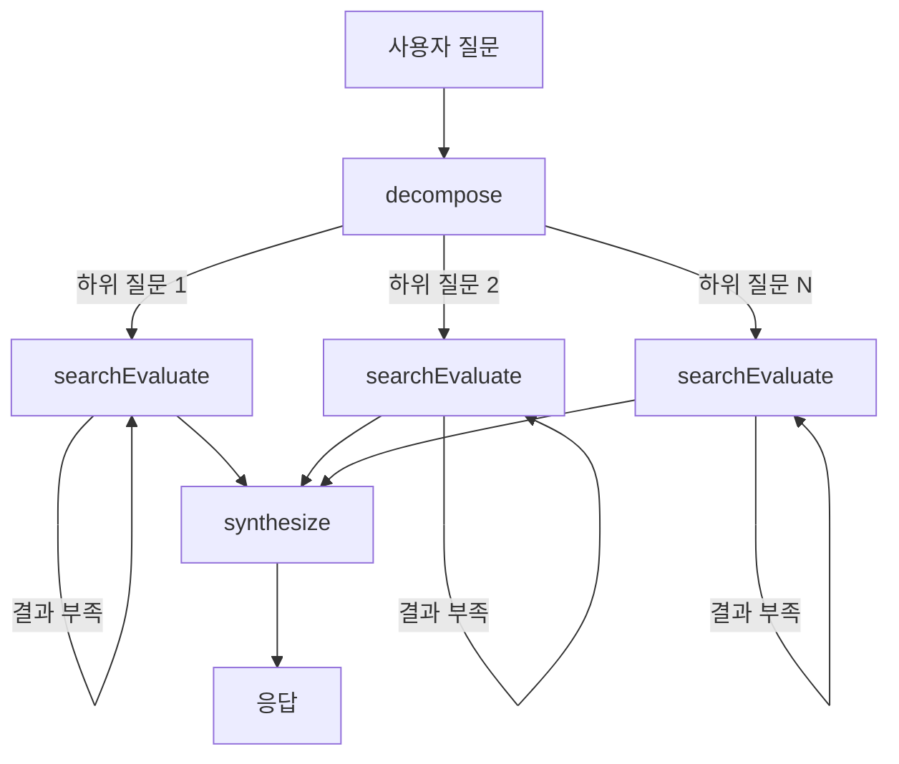

# RAG Chatbot

[https://rag-chatbot.xiyo.dev](https://rag-chatbot.xiyo.dev)

LangChain/LangGraph 기반 문서 Q&A 에이전트

## 구조

| 기능 | 엔트리 파일 | 흐름 |
|------|-------------|------|
| PDF 임베딩 | `src/lib/server/embedding.service.ts` | PDF 업로드 → 청킹 → 임베딩 → DB 저장 |
| RAG 검색 | `src/lib/server/chat/graph.ts` | 질문 분해 → 벡터 검색 → 결과 평가 → 응답 합성 |

---

## RAG Search Pipeline

| 파일 | 역할 |
|------|------|
| `src/lib/server/chat/graph.ts` | LangGraph 상태 머신 정의 |
| `src/lib/server/chat/state.ts` | 상태 스키마 (Annotation API) |
| `src/lib/server/chat/retriever.ts` | SupabaseVectorStore 벡터 검색 |
| `src/lib/server/chat/agents/decompose.agent.ts` | 질문 분해, Send로 병렬 처리 |
| `src/lib/server/chat/agents/searchEvaluate.agent.ts` | 검색 + 평가 루프 (Corrective RAG) |
| `src/lib/server/chat/agents/synthesize.agent.ts` | 인용 포함 응답 합성 |

---

## 주요 설계

**Corrective RAG**: 검색 결과를 LLM이 평가하고, 부족하면 쿼리를 개선하여 재검색 (최대 2회)

**병렬 처리**: 복합 질문을 하위 질문으로 분해 후 LangGraph `Send`로 병렬 실행

**출처 인용**: 응답에 `[ref:N]` 형태로 문서 출처 명시

---

## 기술 스택

| 분류 | 기술 |
|------|------|
| LLM 프레임워크 | LangChain, LangGraph |
| 벡터 저장소 | Supabase pgvector |
| 임베딩 | OpenAI text-embedding-3-small |
| LLM | OpenAI GPT-4o-mini |
