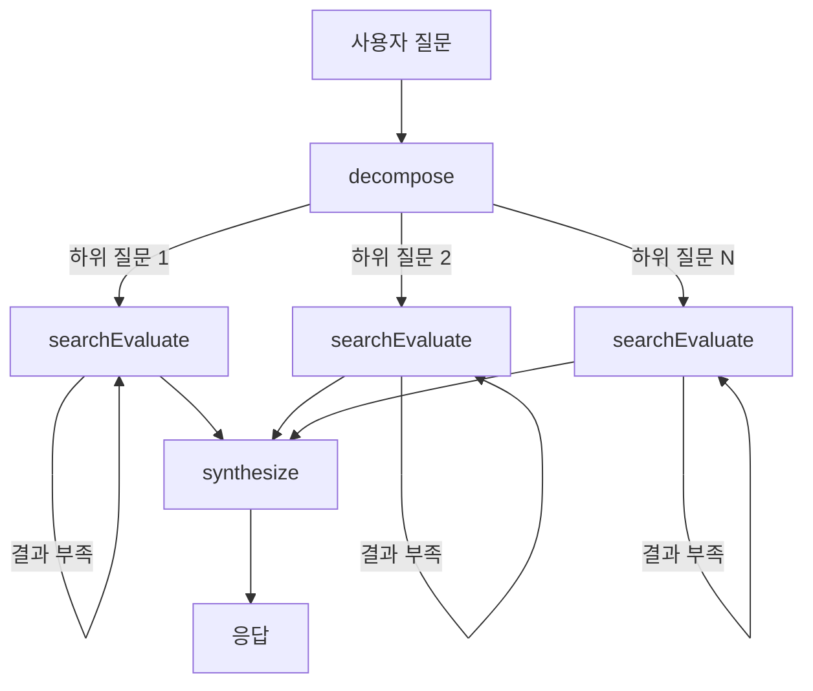

# RAG Chatbot

https://rag-chatbot.xiyo.dev

LangChain/LangGraph 기반 문서 참조 에이전트 프로그램

## 에이전트 흐름

## 핵심 파일

| 파일 | 역할 |
|------|------|
| `chat/graph.ts` | LangGraph 그래프 구성 |
| `chat/state.ts` | 에이전트 상태 스키마 |
| `chat/retriever.ts` | Multi-Query 벡터 검색 |
| `chat/agents/decompose.agent.ts` | 질문 분해 |
| `chat/agents/searchEvaluate.agent.ts` | 검색 + 평가 루프 |
| `chat/agents/synthesize.agent.ts` | 응답 합성 |
| `embedding.service.ts` | 문서 임베딩 파이프라인 |

## 주요 설계

**Multi-Query 검색**: 단일 쿼리 대신 LLM이 생성한 여러 표현으로 검색하여 recall 향상

**검색-평가 루프**: 결과가 부족하면 LLM이 쿼리 개선을 제안하고 재검색 (최대 2회)

**질문 분해**: 복합 질문은 하위 질문으로 분해 후 병렬 처리

**출처 인용**: 응답에 `[ref:N]` 형태로 문서 출처 명시
